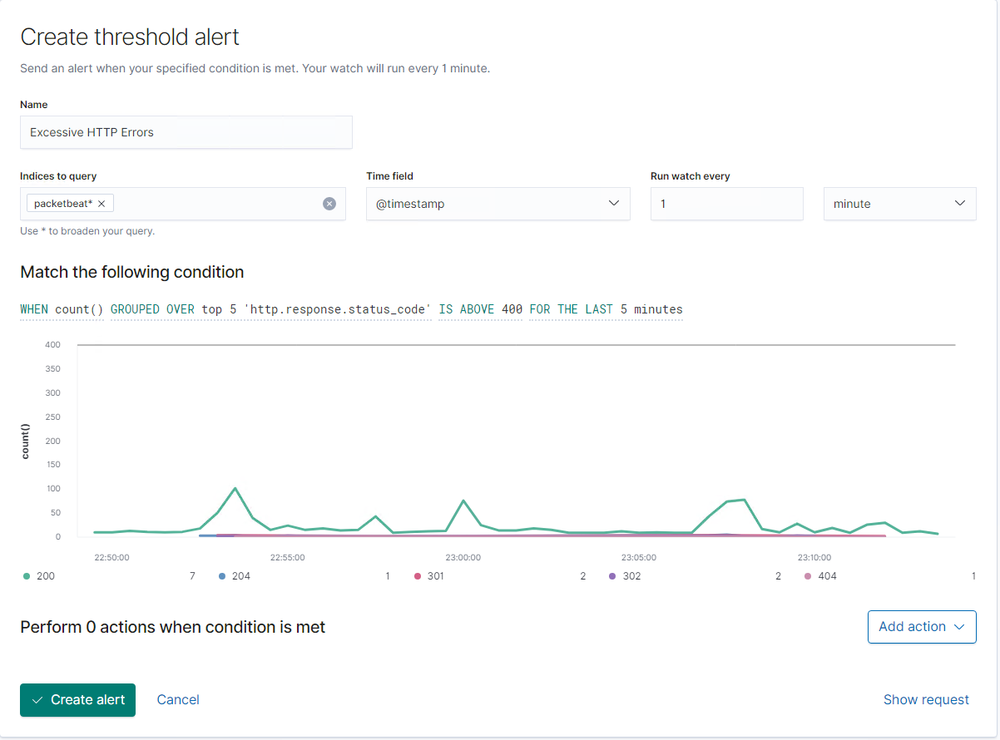
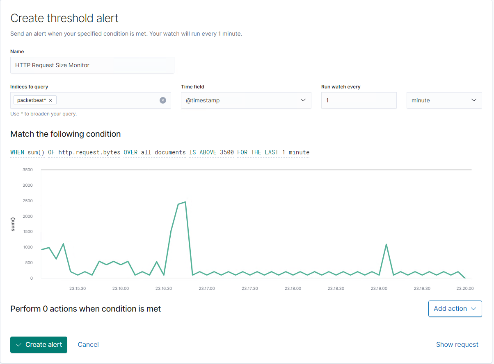
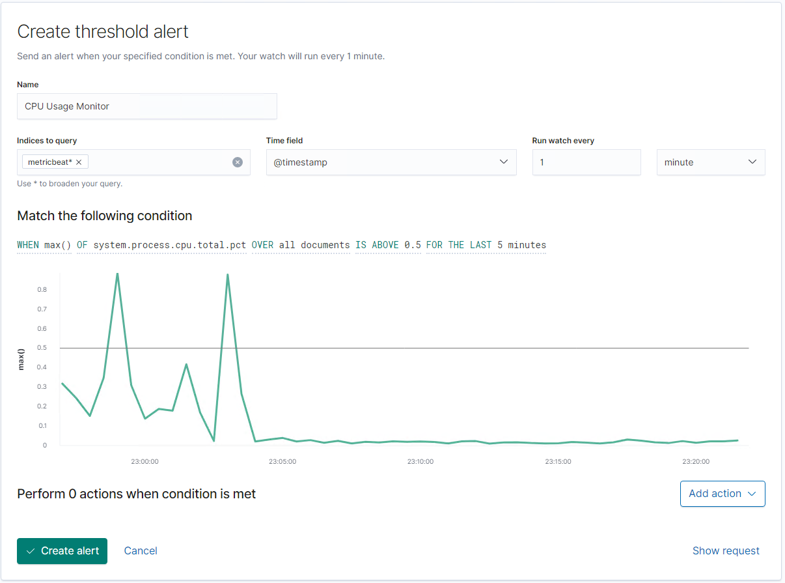

# **Defensive Report**

## **_Table of Contents_**

* Network Topology
* Description of Targets
* Monitoring the Targets
* Patterns of Traffic & Behavior
* Suggestions for Going Further

## **_Network Topology:_**

The following machines were identified on the network:

### _Azure VM_:

Operating System: Windows
Purpose: Hosts the to Other VMs
IP Address: 192.168.1.1 (10.0.0.27)

### _ELK VM_:

* Operating System: Linux
* Purpose: Used to view created alerts and reports from targets
* IP Address: 192.168.1.100

### _Kali VM_:

* Operating System: Linux (Kali)
* Purpose: Used to attack the targets on the network
* IP Address: 192.168.1.90

### _Target 1 VM_:

* Operating System: Linux
* Purpose: Used to host the vulnerable wordpress server for us to attack
* IP Address: 192.168.1.110

### _Target 2 VM_:

* Operating System: Linux
* Purpose: Optional Attack Target
* IP Address: 192.168.1.115

### _Capstone VM_:

* Operating System: Linux
* Purpose: Used to test alerts and log gathering from the ELK machine
* IP Address: 192.168.1.105

## **_Description of Targets:_**
------------------------------

The target of this attack was: Target 1 (192.168.1.110).
Target 1 is an Apache web server and has SSH enabled, so ports 80 and 22 are possible ports of entry for attackers. As such, the following alerts have been implemented:

Monitoring the Targets
Traffic to these services should be carefully monitored. To this end, we have implemented the alerts below:

### _Excessive HTTP Errors_:

Excessive HTTP Errors is implemented as follows:

_Metric_: Top 5 http response status codes

_Threshold_: count of 400 over 5 minutes

_Vulnerability Mitigated_: Brute Forces

_Reliability_: Medium to High depending on size of company

### _HTTP Request Size Monitor_:

HTTP Request Size Monitor is implemented as follows:

_Metric_: Total of all http request bytes on all documents

_Threshold_: 3500 bytes for the last minute

_Vulnerability Mitigated_: DoS Attacks

_Reliability_: High

### _CPU Usage Monitor_:

CPU Usage Monitor is implemented as follows:

_Metric_: CPU Usage percentage on all documents

_Threshold_: Over 0.5 for the last 5 minutes.

_Vulnerability Mitigated_: Malicious Script

_Reliability_: Low

