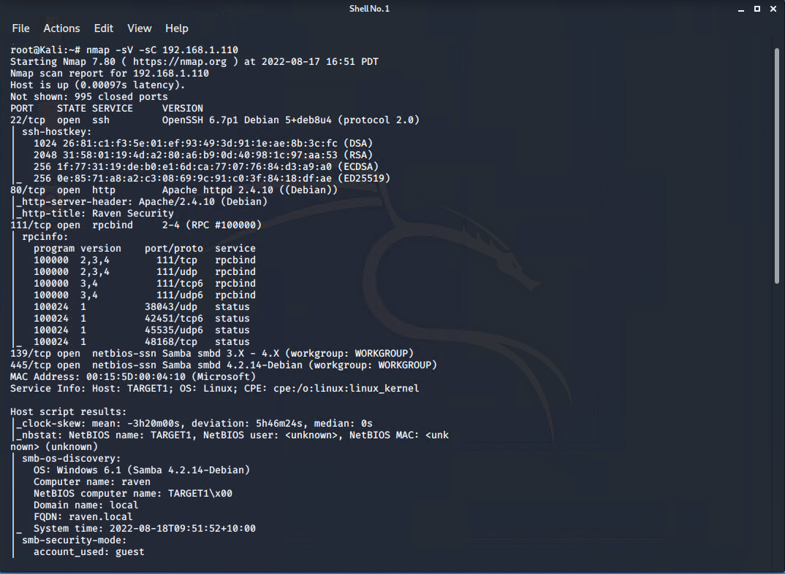

# **Offensive Report**

## **_Table of Contents_**:

* Exposed Services
* Critical Vulnerabilities
* Exploitation

## **_Exposed Services_**:

_Nmap scan results for each machine reveal the below services and OS details_:

* $ nmap -sV -sC 192.168.1.110

This scan identifies the services below as potential points of entry:

* Port 22 SSH
* Port 80 HTTP

## **_List of Exposed Services_**:

The following vulnerabilities were identified on target 1:

## Exploitation
The Red Team was able to penetrate Target 1 and retrieve the following confidential data:

### flag1.txt: _b9bbcb33e11b80be759c4e844862482d_

Exploit Used:

Derby and Recon

### flag2.txt: _fc3fd58dcdad9ab23faca6e9a36e581c_

Exploit Used:

Exposed Username And Weak Password (CVE-2017-7760)(High)

`ssh michael@192.168.1.110`

`password: michael`

### flag3.txt: _afc01ab56b50591e7dccf93122770cd2_

Exploit Used:

SSH Remote Login (CVE-2021-28041)(High)

`ssh steven@localhost`

`password: pink84`

HTML Password Hash Disclosure (CVE-2019-15653)(High)

### flag4.txt: _715dea6c055b9fe3337544932f2941ce_

Exploit Used:

Python Privilege Escalation (CVE-2018-1000030)(Low)

`sudo python -c 'import pty;pty.spawn("/bin/bash");'`
